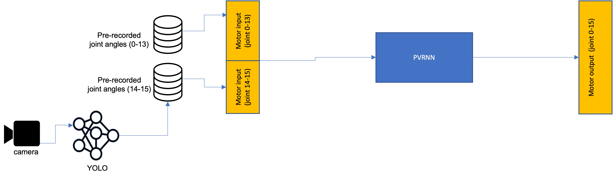

# Tutoring Object Manipulation Skills in a Human-Robot Interaction Paradigm

This project explored the ability of recurrent neural networks trained on a small set of motor primitives to generate meaningful novel patterns with limited corrective feedback from the experimenter.

### Click to watch video

## Introduction

According to one hypothesis, complex motor behaviors are compositions of a limited set of innate and/or learned motor primitives. We attempted to test this hypothesis in a humanoid robot controlled by a recurrent neural network (RNN). Specifically, our robot was trained to grasp a target object in three different locations. If the hypothesis is true, the robot should be able grasp the target not only in the trained, but also in other locations. 

Aware that model architecture might lead to vastly different results, we explored two alternative architectures: a simpler deterministic RNN (with and without a separately trained variational autoencoder) and a more advanced variational Bayes RNN. In the Methods section below we limit our account to the most important aspects, for full details please see the code in this repo.

## Methods

We used a 16-joint humanoid robot (Torobo Humanoid, Tokyo Robotics). The models were trained on a dataset of three primitives either  representing separate sequences each or stacked along the time axis into one long trajectory. A primitive was defined as a sequence of joint angle vectors of size 16 comprising a motion trajectory. Each primitive began at the starting position, continued smoothly until the object -- a soft toy die (approx. 13 x 13 x 13 cm) lying on a white plastic surface -- was grasped, (for the deterministic model -- also lifted, put back on the table), released, and terminated back at the starting position. Complete with motor data (joint angles comprising the movement trajectory) the datasets contained temporally synchronized visual inputs (grayscale images of size 64 x 64 pixels). The training data were recorded using a separate Python script at 10 Hz as the robot's arms were moving along a trajectory of seven waypoints, while the head was fixated on the object by an independently running object detection model (YOLO v3  [[1]](#1) and [[2]](#2)). Note that with the deterministic models YOLO was only used during training, while during testing the RNN controlled all the joints (including neck). The deterministic models were were implemented in PyTorch and trained with two loss functions (for motor and visual loss). For the stochastic model we used the NRL C++ library; for details please refer to [[3]](#3) and [[4]](#4).

## Deterministic models

We used two slightly different deterministic models. The first and simpler one (Figs. 1 and 2) was trained on a dataset of three primitives each representing a separate sequence; the primitives were stacked along the time axis into one long trajectory.

<em>Figure 1: Deterministic model at training.</em>
  

However, the downside of this approach is that the model may simply learn one long trajectory and be 'reluctant' to switch/interpolate between primitives in a way that is not consistent with the order of points in the training trajectory. In other words, it is unclear whether such a model can in principle handle cases where the die is located off the spots seen during training.

<em>Figure 2: Deterministic model at testing.</em>
  

Training the RNN on separate sequences seemed a reasonable next step. Our second model (Fig. 3) was trained on separate primitives. During training, initial hidden states corresponding to each trajectory were taken from the bottleneck of a separate variational autoencoder pre-trained on the same dataset. These hidden states provided low-dimensional representations of the future trajectory the RNN should generate. With only three primitives three different arbitrary hidden variables would work equally well, but with a larger number of primitives the corresponding initial hidden states should retain the relative structure of the primitives they encode.

<em>Figure3. Deterministic model at training on separate sequences. The difference from Fig. 1 is that for each training sequence an initial hidden state is generated by a VAE pre-trained on the same dataset. Transparent blocks of the VAE are unused during testing.</em>
  

## Stochastic model

For the stochastic model we took a different approach, in which the head was kept fixated on the target by an independent object-detection model (YOLO ¥cite{yolov3, ErikLinderNoren2020}) both during training and testing. The main control model (PV-RNN [[3]](#3)) received no direct visual input; it could only infer the position of the target based on the the angles of joints 14 and 15 (neck). Thus, despite no high-dimensional visual input, the PV-RNN was able to learn the association between the position of the object on the table and where arms should be moved next to complete the task with the least error possible. For YOLO, we used weights pre-trained on the CoCo dataset and trained them for 1000 epochs on 109 images of and corresponding bounding boxes around the target object. The bounding boxes were drawn manually using the OpenLabeling software [[5]](#5)).

<em>Stochastic model at training. The robot's arms and neck follow pre-recorded trajectories. PV-RNN learns to predict arm joint angles at the next step based on current arm and neck positions.</em>
  

<em>Stochastic model at testing. The model receives proprioceptive feedback from the joints, two of which (14, 15) are controlled by YOLO.</em>
  

## Testing

At testing, the robot's arms are set to an external force following online trajectory mode in which the robots arms move along the trajectory predicted by the model, but also respond to external forces applied by the experimenter. We hypothesized that if the model learns several attractors corresponding to a specific trajectory, it would be possible for the experimenter to encourage the robot -- by pushing and pulling at its arms -- to switch from one primitive to another and potentially generate meaningful novel motions (e.g. reaching for the target in a location not seen at training).

## Results

With the caveat that more experimenting is necessary, the deterministic RNN trained on one  dataset of three stacked trajectories performed best (see [Video 1](https://youtu.be/JDUFVfB_m2I), [Video 2](https://youtu.be/gvtrafrl8U8), [Video 3](https://youtu.be/t3FlPp70nlI), and [Video 4](https://youtu.be/Zgrf4W37GI4)). In terms of human-robot interaction, this model responded to the experimenter moving the robot's hands apart and seeminly 'tried' to grasp the target in locations between those present in the training data. Specifically, when the robot was stuck holding the target for a long time, a slight push by the experimenter was enough to help the robot go back the the starting position (arms wide open). 

## References
<a id="1">[1]</a> 
J. Redmon and A. Farhadi, “Yolov3: An incremental improvement,” arXiv, 2018.

<a id="2">[2]</a> 
[E. Linder-Noren, “Pytorch- yolov3.”](https://github.com/ eriklindernoren/PyTorch-YOLOv3, 2020.)

<a id="3">[3]</a> 
J. A. Ahmadi and J. Tani, “A novel predictive-coding-inspired variational rnn model for online prediction and recognition,” Neural computation, vol. 31, no. 11, pp. 2025–2074, 2019.

<a id="4">[4]</a> 
H. F. Chame, A. Ahmadi, and J. Tani, “Towards hybrid primary intersub- jectivity: a neural robotics library for human science,” arXiv preprint arXiv:2006.15948, 2020.

<a id="5">[5]</a> 
J. Cartucho, R. Ventura, and M. Veloso, “Robust object recognition through symbiotic deep learning in mobile robots,” in 2018 IEEE/RSJ Interna- tional Conference on Intelligent Robots and Systems (IROS), pp. 2336–2341, 2018.

# Code

## RECORD_SEPARATE_trajectories_2.ipynb

- builds several trajectories based on captured waypoints, saves them into a rada file
- replays all the trajectories (with short pauses to reposition the cube), while densely recording
  joint angles and video frames. records into 'rad0.dat', 'rad1.dat' files
      dictionaries with keys ('joints', 'igm', 't')
- allows one to see video and joint angles from recorded trajectories

## VAE_RNN (vid_motor) TRAIN.ipynb

- a VAE encodes video and joint angles together into a latent representation of size 20 (16 joints, no compression, video 64x64 into a 4d representation)
- uses the latent representations obtained by forwarding the first frame through the vae
- in a sequence and the joint angles at time 0, as *the hidden states* for the RNN
- the (determnistic) RNN similarly to the the vae takes visual and motor input, but instead at its bottleneck it has a recurrentlayer.

## VAE_RNN (vid_motor) TEST.ipynb

- trained on three similar but separate trajectories (not concatenated)
- the VAE (encodes the motor+visual into a latent state) and rnn (uses the latent state
  as the initial hidden state) models
- weights trained by `vae_encode_vid_motor_test.ipynb`
- uses these models to controls the physical robot, VAE encodes video and joint angles together into a latent representation of size 20 (16 joints, no compression + video 64x64 into a 4d representation)

## RECORD_SEPARATE_trajectories_3_w_head.ipynb

Same as RECORD_SEPARATE_trajectories_2.ipynb but also records data for the training of PV-RNN/YOLOv3.	

## Train RNN.ipynb

This notebook trains a deterministic RNN.

## Test RNN-Original_Firmware.ipynb

This notebook tests a deterministic RNN (trained in Train RNN.ipynb) and calls/implements all the necessary control functions to run the cube grab-and-lift experiment.

## PVRNN Prior Generation-with_head_tracking.ipynb

Loads a pre-trained PV-RNN/YOLOv3 model and demonstrates PV-RNN in the prior generation mode. I.e. generates a primitive seen during training.

## ERROR REGRESSION_with_head_tracking.ipynb

Loads a pre-trained PV-RNN/YOLOv3 model and demonstrates PV-RNN in the error regression mode.

`checkpont_ww` [BEST] - this checkpoint reproduces the motions WELL. Here we allow the robot's head to track the object. No concatenations.
`checkpoint_ww1` - here we object tracking is OFF. Dataset IS concatenated
`checkpoint_ss` - object tracking is on, datasets concatenated, pred 0.1, gt 0.9

## The best model

`checkpoint_overnight_90_10`
- object tracking is on
- datasets concatenated
- pred 0.1, gt 0.9 
- OVERNIGHT TRAINING

# Licence

Copyright © 2021, Okinawa Institute of Science and Technology.

Licensed under the Apache License, Version 2.0 (the "License"); you may not use this file except in compliance with the License. You may obtain a copy of the License at http://www.apache.org/licenses/LICENSE-2.0. Unless required by applicable law or agreed to in writing, software distributed under the License is distributed on an "AS IS" BASIS, WITHOUT WARRANTIES OR CONDITIONS OF ANY KIND, either express or implied. See the License for the specific language governing permissions and limitations under the License.
